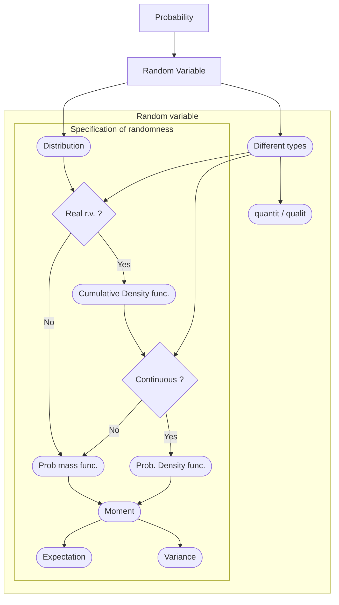

<!-- ------------ General Header Template 0.3.6 ------------ -->
- Metadata :
	- 🆔 Zettelkasten_ID : {{date:YYYYMMDD}}{{time:HHmmss}}
	- 🗺 Index : [[Wikiversity - Unknown ⚠️]]

Created : {{date}}

***************************************************************


# {{title}}

> 例如, 随机变量

## Summary - 概述

随机变量 (random variable) 是 [[Wikiversity - Unknown ⚠️]] 的核心概念. 正如 这个概念的命名 "随机变量" 所指, 它是一个变量, 它的赋值 带有随机性. 

## Context - 预备知识

列出预备知识

- [[Topic - Unknown ⚠️]]



## Goals - 学习目标

> 例如 🌰 :
> 
> - Know the definition of a random variable (as a function on the sample space)
> - Know the definition of the distribution of a random variable
> - Know the distinction between discrete and continuous random variables
> - Know how distributions can be represented in terms of probability mass functions and probability density functions

## Core notes - 核心笔记

> 📌 Hint :
> - 关于 随机变量定义的 核心笔记
> - 假设, 我们 给别人介绍这个概念, 大纲内 必要的  内容

```
- [[Random variables 随机变量]]
- [[Cumulative distribution function 累积分布函数]]
- [[Types of Random variables - Discrete and continuous 离散随机变量, 连续随机变量]]
- [[Probability density functions 概率密度函数]]
```

## Supplemental notes - 补充笔记

> - 概念的 重要性质研究
> - 概念的 重要应用. 

> 关于 概念定义的 辅助笔记, 
> - 假设, 我们 给别人介绍这个概念, 这里 涉及一些 非必要的 (可能超纲的), 但是 **有趣的 ** 内容


***************************************************************
***************************************************************
<!-- Placeholder for pandoc Exportation with BibTeX -->

## References 📚
