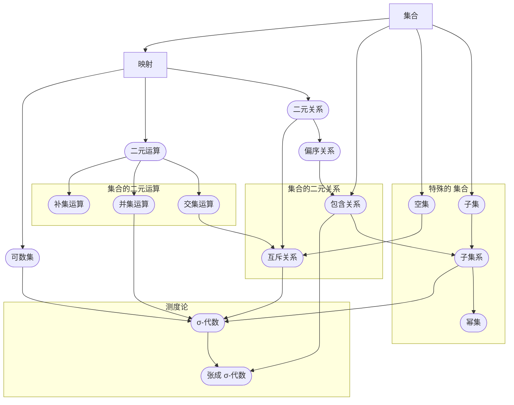
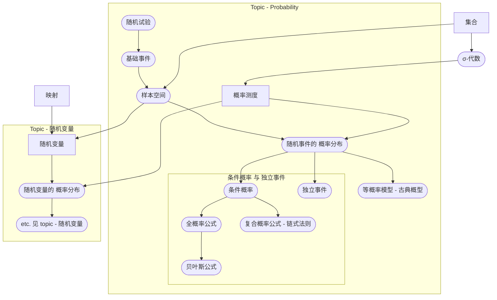

<!-- ------------ General Header Template 0.3.6 ------------ -->
- Metadata :
	- 🆔 Zettelkasten_ID : 20210120224533
	- 🗺 Index : [[Wikiversity 🎓  - 🎲 Probability thoery 概率论 (占坑)]]

Created : [[2021-01-20 Wednesday]]

***************************************************************

# Topic - Probability 概率

## Summary - 概述

概率论 是  研究 不确定事件的 一套数学理论. 
概率 从数学上, 是一个 满足一些 特殊条件 (这些 条件 被称为 概率公理 ) 的 映射

- **从直觉上**, 如果我们有一个 结果带有随机性的 实验,  众多结果中 "某一结果的概率" 可以被看做 是 长期重复 这个实验 这个结果 出现的频率
	- 然而, 这种对于"概率" 基于"频率"的 认知, 可能会造成 一些 困扰. 比如, 对于 无法重复的 带有随机性的试验, 例如, 明天的天气 则 没有办法 解释
- **从数学上**, 概率 是 [[Sample space 样本空间|样本空间 (sample space)]] 的 满足一些 条件的 映射.

## Context - 预备知识

这个主题 需要的预备知识 有

- [[Topic - Set 集合]]
	- [[Power set 幂集]]
	- [[Binary relation#Binary relation 二元关系|Binary relation 二元关系]], 集合的 包含关系,  
	- [[Mathematical structure 数学结构|数学结构 (Mathematical structure)]]
- [[Topic - Map 映射]]
- [[Topic - Measure theory 测度论 (仅讨论部分知识点)]]
	- [[σ-algebra σ-代数|σ-代数 (σ-algebra)]]

## Goals - 学习目标

-   了解 样本空间 (sample space) and 随机事件 (events)
-   了解 概率公理 (axioms of probability)
-   有限概率空间 (finite probability spaces)
-   了解 概率 在生产生活中的 两种 直观解读 :
	-   某一个 可重复发生的 随机事件 某结果发生的 (客观的) **频率** (objective frequency)
	-   某一个 可重复发生的 (或 不可重复发生的) 随机事件 某一结果 出现与否的 (主观的) 信任程度 (subjective belief)

## Core notes - 核心笔记

- [[Probability measure 概率测度#Probability 概率|Probability measure 概率测度]]
- [[Experiment (Probability theory) 随机试验#Experiment 随机试验|Experiment (Probability theory) 随机试验]]
	- [[Event (Probability theory) 概率事件#Event Probability theory 概率事件|Event (Probability theory) 随机事件]]
	- [[Sample space 样本空间#Sample space 样本空间|Sample space 样本空间]]
- [[Conditional probability 条件概率 (占坑)#Conditional probability 条件概率|Conditional probability 条件概率]]
	- [[Formule des probabilités totales 全概率公式 (占坑)]]
	- [[Formule de Bayes 贝叶斯公式 (占坑)]]
	- [[Independence (Probability thoery) 独立性 (占坑)]]

## Supplemental notes - 补充笔记

- [[试验 Vs 实验]]: 随机试验 是什么 ?
- [[什么是直觉|直觉 (intuition)]]
	- [[违反直觉的 概率问题]]
- [[Paradoxe de Bertrand]]: Bertrand 悖论, 概率是主观的 还是客观的 ?

***************************************************************
***************************************************************
<!-- Placeholder for pandoc Exportation with BibTeX -->

## References 📚
